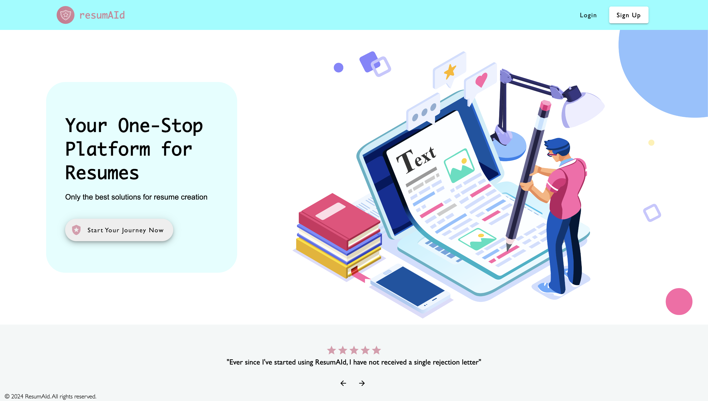

# ResumAId

    

ResumAId takes resume writing to a whole new level. It elevates the resume-writing process by providing a comprehensive suite of tools designed for efficiency and effectiveness. Users can effortlessly create resumes from scratch, manage multiple drafts, and access a range of end-to-end solutions to help them stand out. ResumAId leverages on advanced AI technology to enhance resumes, and also provides private consultation services for more personalized advice. With ResumAId, you have a one-stop platform for all your resume needs.

## Website

[resumaid.up.railway.app](https://resumaid.up.railway.app)

## Table of Contents

- [Main Features](#main-features)
- [Usage](#usage)
- [Technologies](#technologies)
- [Miscellaneous](#miscellaneous)

## Main Features

- 📄 Resume Writing:
  - Create your own resume and see it come to live instantly with our in-built template
  - View and edit all existing resume drafts, and save them as existing or new copies.
  - Use AI to enhance your resume pointers
  - Download and export your resumes as PDF
- 🗣️ Consultations:
  - Book 1:1 appointments with our resume consultants
  - Make secure payments with Stripe
  - View all upcoming consultations and link to their Google Meet links directly

## Usage

1.

## Specifications

- Languages:
  - HTML & CSS
  - Java 21
  - Typescript
- Frameworks:
  - Spring Boot for Backend
  - Angular 17 for Frontend
- Build Tool:
  - Maven
- Databases:
  - MySQL for user information and bookings
  - MongoDB for resumes
- Technologies:
  - RESTful API
  - JWT for user authentication and authorisation (expires within 1 day)
  - Email for registration auto-confirmation
  - Ollama4j ([Link](https://github.com/amithkoujalgi/ollama4j)) for AI model service
  - Digital Ocean S3 for storage of images and droplet (VM) to run Ollama model
  - Stripe integration for payment (test key)
  - Google Calendar integration for booking and scheduling
  - Html2canvas to download as PDF ([Link](https://www.npmjs.com/package/html2canvas/v/1.4.1))
  - Angular Material as UI component framework
  - Sweetalert for alerts and confirmations ([Link](https://www.npmjs.com/package/sweetalert))
  - Angular PWA ([Link](https://www.npmjs.com/package/@angular/pwa))
  - Angular Service worker ([Link](https://www.npmjs.com/package/@angular/service-worker))
  - Docker for containerization
  - Railway for deployment

## Miscellaneous

#### Further Developments:

- Add more template selections for different jobs
- Integrate with job application portals for end-to-end solution

#### Module: NUS-ISS Software Development Professional Diploma Final Project
